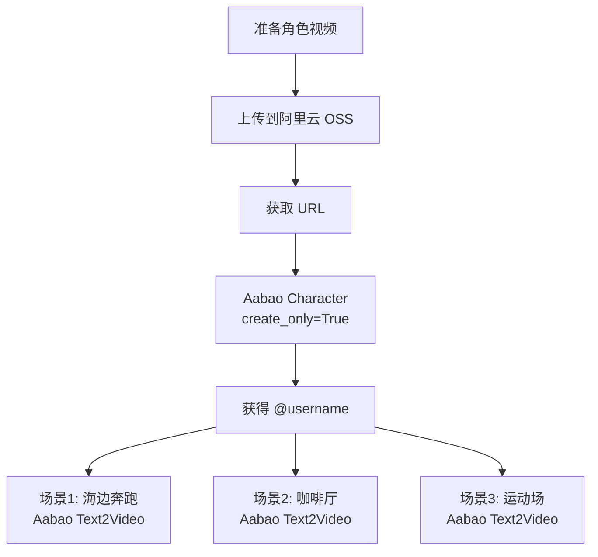

# Aabao 角色创建使用指南（最终版）

## ⚠️ 关键限制

**服务器只接受真实的 HTTP/HTTPS URL！**

经过测试确认，Aabao API 服务器：
- ❌ **不支持**文件上传（multipart/form-data）
- ❌ **不支持** Base64 data URI（服务器会尝试 curl 下载导致失败）
- ✅ **只接受**真实的 HTTP/HTTPS 视频直链

## 唯一可用方式：video_url

### 📋 完整步骤

**步骤 1: 上传视频到云存储**

将角色视频上传到以下任一服务：

| 服务 | 优点 | 获取直链方法 |
|------|------|-------------|
| **阿里云 OSS** | 稳定快速 | 对象 → 详情 → 复制 URL |
| **腾讯云 COS** | 国内快速 | 文件列表 → 复制链接 |
| **七牛云** | 简单易用 | 外链 → 复制 |
| **Cloudflare R2** | 国际访问好 | Public URL |
| **GitHub Releases** | 免费 | 右键复制链接地址 |

**步骤 2: 获取视频直链**

确保获取的 URL 满足：
- ✅ 以 `http://` 或 `https://` 开头
- ✅ 可直接在浏览器打开并播放
- ✅ 无需登录或 Cookie
- ✅ 没有防盗链保护

**测试 URL 是否可用：**
```bash
# 在浏览器无痕模式打开 URL，能播放即可用
# 或使用 curl 测试：
curl -I "你的视频URL"
# 应返回 200 OK 和 Content-Type: video/mp4
```

**步骤 3: 在 ComfyUI 中使用**

1. 添加 `Aabao 角色创建` 节点
2. 填入 `video_url`（必填）
3. 设置 `create_only`：
   - `True` - 仅创建角色，返回 @username
   - `False` - 创建角色并生成视频
4. 如果 `create_only=False`，填写 `prompt` 描述动作
5. 运行节点

---

## 节点参数说明

### 必需参数

| 参数 | 类型 | 说明 | 示例 |
|------|------|------|------|
| `api_provider` | 选择 | API 提供商 | `aabao` |
| `api_key` | 字符串 | API 密钥 | 留空使用 config.json |
| `video_url` | 字符串 | **视频直链 URL（必填）** | `https://cdn.example.com/video.mp4` |
| `create_only` | 布尔 | 是否仅创建角色 | `True` |

### 可选参数

| 参数 | 类型 | 说明 | 使用场景 |
|------|------|------|----------|
| `prompt` | 字符串 | 角色动作描述 | `create_only=False` 时需要 |
| `model` | 选择 | 模型选择 | 默认 `sora-2-characters` |

---

## 使用场景

### 场景 1: 仅创建角色

**目标**: 提取角色信息，获取 `@username` 标识符

**配置:**
```
video_url: https://your-cdn.com/character.mp4
create_only: True
prompt: (留空)
```

**输出:**
- `username`: `@john_doe123`
- `character_id`: 任务 ID
- `status`: "✅ 角色创建成功! @john_doe123"

**后续使用:**
```
在 Aabao Text2Video 节点的 prompt 中：
"@john_doe123 在海边奔跑，夕阳西下"
```

---

### 场景 2: 创建角色并生成视频

**目标**: 一步完成角色创建和视频生成

**配置:**
```
video_url: https://your-cdn.com/character.mp4
create_only: False
prompt: "这个角色在公园里散步，阳光明媚"
model: sora-2-landscape-15s
```

**输出:**
- `video`: 生成的视频文件
- `Filenames`: VHS 格式的文件列表
- `status`: "✅ 角色视频生成成功!"

---

## 推荐的视频规格

| 属性 | 推荐值 | 说明 |
|------|--------|------|
| **分辨率** | 1080p 或 720p | 清晰度足够 |
| **时长** | 3-10 秒 | 展示角色特征 |
| **格式** | MP4 (H.264) | 兼容性最好 |
| **大小** | < 10MB | 服务器限制 |
| **帧率** | 24-30 fps | 标准帧率 |
| **内容** | 正面清晰展示 | 光线充足，背景简单 |

---

## 云存储服务推荐

### 阿里云 OSS（推荐）

**优点:**
- ✅ 稳定可靠
- ✅ 国内访问快
- ✅ 按量付费

**使用步骤:**
1. 创建 Bucket（公共读）
2. 上传视频文件
3. 获取对象 URL
4. 复制直链使用

**价格:** ~¥0.12/GB/月（存储）+ ¥0.5/GB（流量）

---

### 腾讯云 COS

**优点:**
- ✅ 集成方便
- ✅ 价格实惠
- ✅ 支持 CDN 加速

**使用步骤:**
1. 创建 Bucket
2. 权限设置为公有读
3. 上传文件
4. 复制访问链接

**价格:** ~¥0.118/GB/月

---

### 七牛云

**优点:**
- ✅ 简单易用
- ✅ 有免费额度
- ✅ 文档齐全

**免费额度:**
- 10GB 存储
- 10GB 流量/月

---

### GitHub Releases（免费方案）

**优点:**
- ✅ 完全免费
- ✅ 国际访问好
- ✅ 长期存储

**缺点:**
- ⚠️ 单文件 < 2GB
- ⚠️ 国内访问可能慢

**使用步骤:**
1. 创建 GitHub 仓库
2. 发布 Release
3. 上传视频作为附件
4. 右键复制链接地址

---

## 常见问题

### Q1: 为什么不支持本地文件上传？

**A**: 这是 Aabao API 服务器的设计限制。服务器端代码设计为：
1. 接收一个 URL 字符串
2. 使用 curl 命令下载该 URL
3. 处理下载的视频

尝试发送文件或 Base64 都会被当作 URL 来 curl 下载，导致失败。

---

### Q2: 错误 "Port number was not a decimal number"

**原因**: 服务器尝试将 Base64 data URI 当作 URL 来 curl 下载

**解决**: 只使用真实的 HTTP/HTTPS URL，不要使用 Base64

---

### Q3: 错误 "服务器尝试下载 URL 失败"

**可能原因:**
1. URL 不是公开访问（需要登录）
2. 有防盗链保护（检查 Referer）
3. URL 已过期或被删除
4. 服务器网络无法访问该域名

**排查步骤:**
```bash
# 1. 浏览器无痕模式测试
打开无痕窗口，粘贴 URL，看能否播放

# 2. curl 测试可访问性
curl -I "你的URL"
# 应返回 200 OK

# 3. 检查 Content-Type
curl -I "你的URL" | grep Content-Type
# 应包含 video/
```

**解决方案:**
- 使用公开的云存储服务
- 关闭防盗链保护
- 确保 URL 不需要认证

---

### Q4: 如何压缩视频？

如果视频过大，可以使用 FFmpeg 压缩：

```bash
# 压缩到指定大小（约 5MB）
ffmpeg -i input.mp4 -vcodec h264 -crf 28 -s 1280x720 output.mp4

# 更激进的压缩（约 2MB）
ffmpeg -i input.mp4 -vcodec h264 -crf 32 -s 960x540 output.mp4

# 裁剪时长（只保留前 5 秒）
ffmpeg -i input.mp4 -t 5 -c copy output.mp4
```

---

### Q5: 哪些云存储服务不推荐？

**避免使用:**
- ❌ 个人网盘分享链接（有时效性）
- ❌ 社交媒体上传的视频（有压缩和防盗链）
- ❌ 需要 Cookie 的服务
- ❌ 临时文件分享服务

---

## 完整工作流示例

### 示例 1: 创建角色用于多个场景



**步骤详解:**

1. **上传视频**
   ```bash
   # 使用 OSS 工具上传
   ossutil cp character.mp4 oss://my-bucket/assets/
   ```

2. **获取 URL**
   ```
   https://my-bucket.oss-cn-shanghai.aliyuncs.com/assets/character.mp4
   ```

3. **创建角色节点**
   ```
   video_url: https://my-bucket.oss-cn-shanghai.aliyuncs.com/assets/character.mp4
   create_only: True
   ```

4. **使用角色生成多个视频**
   ```
   场景1 prompt: "@sarah_chen 在海边奔跑，浪花拍打，夕阳西下"
   场景2 prompt: "@sarah_chen 在咖啡厅看书，温馨安静"
   场景3 prompt: "@sarah_chen 在运动场打篮球，活力四射"
   ```

---

## 故障排除流程图

```
视频URL准备好了吗？
    ↓ 是
在浏览器无痕模式能播放吗？
    ↓ 是
URL是 http:// 或 https:// 开头吗？
    ↓ 是
填入 video_url 参数
    ↓
运行节点
    ↓
还是报错？ → 查看错误信息
    ↓
"curl 下载失败" → URL 可能有防盗链或认证
    ↓
"Port number" → 确认没使用 Base64
    ↓
"Too Large" → 压缩视频文件
    ↓
"超时" → 检查网络或换个云存储
```

---

## 最佳实践

### 1. 视频准备

```python
# 理想的角色视频特征
✓ 清晰展示角色正面全身
✓ 光线充足，背景简单纯色
✓ 稳定镜头（使用三脚架）
✓ 3-5 秒最佳（不要太长）
✓ 角色做简单动作（转身、微笑等）
✓ 避免复杂背景和其他人物
```

### 2. 云存储配置

```yaml
Bucket 设置:
  权限: 公共读（public-read）
  防盗链: 关闭
  CORS: 允许
  缓存: 开启（提升访问速度）
```

### 3. URL 管理

```bash
# 建议使用短链或自定义域名
原始 URL:
https://bucket.oss-region.aliyuncs.com/path/to/very-long-filename.mp4

优化后:
https://cdn.yourdomain.com/char/001.mp4
```

---

## 技术细节

### API 请求格式

```json
POST /v1/videos
Content-Type: application/json

{
  "model": "sora-2-characters",
  "video": "https://cdn.example.com/character.mp4"
}
```

### 服务器处理流程

```
1. 接收请求（JSON）
2. 提取 video 字段的 URL
3. 使用 curl 下载视频
4. 处理视频，提取角色特征
5. 返回角色信息（@username）
```

### 为什么其他方式不行

| 方式 | 服务器行为 | 结果 |
|------|-----------|------|
| 文件上传 | 收到文件流，但期望的是 URL 字符串 | ❌ 参数解析失败 |
| Base64 | 将 data:video/... 当作 URL curl | ❌ Port number 错误 |
| 真实 URL | curl 下载成功 | ✅ 正常工作 |

---

## 成本估算

### 阿里云 OSS（每月处理 100 个角色）

```
假设：
- 每个视频 5MB
- 存储 50 个视频（25GB）
- 每个视频下载 10 次（500 次下载，2.5GB 流量）

费用：
存储: 25GB × ¥0.12 = ¥3.0
流量: 2.5GB × ¥0.5 = ¥1.25
总计: ¥4.25/月
```

### GitHub Releases（免费方案）

```
优点: 完全免费
限制: 
- 单文件 < 2GB
- 无流量限制
- 永久存储

适合: 低频使用、学习测试
```

---

## 更新日志

### v3.0 - 最终版 (2025-12-11)

**移除:**
- ❌ 文件上传功能（服务器不支持）
- ❌ Base64 编码功能（服务器当作 URL curl）
- ❌ video 端口（不再需要）
- ❌ use_base64 参数（不可用）

**简化:**
- ✅ 只保留 video_url 一种方式
- ✅ video_url 改为必填参数
- ✅ 更清晰的错误提示
- ✅ 完整的使用指南

**改进:**
- 🎯 URL 格式验证
- 📝 详细的故障排除步骤
- 💡 云存储服务推荐
- 🔍 成本估算参考

---

## 获取帮助

遇到问题请提供：
1. ✅ 使用的 video_url（脱敏）
2. ✅ 完整的错误信息
3. ✅ 浏览器能否打开该 URL
4. ✅ curl 测试结果

**快速验证 URL:**
```bash
curl -I "你的视频URL"
```

应该看到：
```
HTTP/1.1 200 OK
Content-Type: video/mp4
Content-Length: 5242880
```

---

**祝你使用愉快！** 🎉

*本指南基于实际测试编写，确保所有方案可用。*